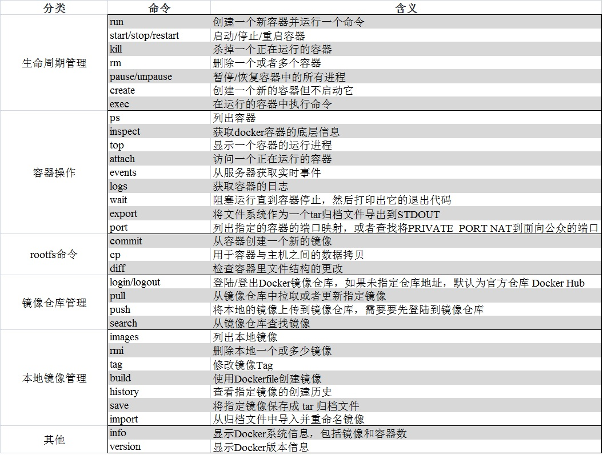

## docker命令概览

## 部分重要命令参数详情
1.docker run或者docker create  
run 							|create |含义
----- 							|-----  |-----
-a, --attach=[] 				|同     	|Attach to STDIN, STDOUT or STDERR
--add-host=[] 					|同       	|添加hostname:ip到/etc/hosts中
--blkio-weight=0 				|同    	|块IO(相对权重)，介于10和1000之间，或0禁用(默认为0)
--blkio-weight-device=[] 		|同    	|块IO的权重(相对设备权重，格式: DEVICE_NAME:WEIGHT)
--cpu-shares=0 					|同      	|CPU权重(相对权重)
--cap-add=[] 					|同        	|Add Linux capabilities.
--cap-drop=[] 					|同       	|Drop Linux capabilities.
--cgroup-parent="" 				|同  		|Path to cgroups under which the cgroup for the container will be created.
--cidfile="" 					|同        	|将容器ID写入文件。
--cpu-count=0 					|同       	|限制容器可用cpu数量。
--cpu-percent=0 				|同     	|CPU百分比(仅限Windows).
--cpu-period=0 					|同      	|限制CPU CFS(完全公平的调度程序)周期。
--cpuset-cpus="" 				|同    	|CPUs in which to allow execution (0-3, 0,1).
--cpuset-mems="" 				|同    	|Memory nodes (MEMs) in which to allow execution (0-3, 0,1). Only effective on NUMA systems.
--cpu-quota=0 					|同      	|Limit the CPU CFS (Completely Fair Scheduler) quota.
--cpu-rt-period=0 				|同   		|Limit the CPU real-time period in microseconds.
--cpu-rt-runtime=0 				|同  		|限制CPU每微秒的实时运行时间。
--cpus=0.0 						|同  		|限制cpu数量，默认0.0，意为不限制。
--device=[] 					|同 		|Add a host device to the container (e.g. --device=/dev/sdc:/dev/xvdc:rwm)
--device-read-bps=[] 			|同        	|限制从设备读取字节速率 (例如： --device-read-bps=/dev/sda:1mb)
--device-read-iops=[] 			|同       	|限制从设备读取IO速率 (例如： --device-read-iops=/dev/sda:1000)
--device-write-bps=[] 			|同       	|限制设备的写入字节速率(例如： --device-write-bps=/dev/sda:1mb)
--device-write-iops=[] 			|同      	|限制设备的写入IO速率 (例如： --device-write-iops=/dev/sda:1000)
--dns=[] 						|同    	|Set custom DNS servers
--dns-option=[] 				|同     	|Set custom DNS options
--dns-search=[] 				|同     	|Set custom DNS search domains (Use --dns-search=. if you don't wish to set the search domain)
-e, --env=[] 					|同        	|设置环境变量
--entrypoint="" 				|同     	|Overwrite the default ENTRYPOINT of the image
--env-file=[] 					|同       	|Read in a line delimited file of environment variables
--expose=[] 					|同 		|Expose a port, or a range of ports (e.g. --expose=3300-3310) informs Docker that the container listens on the specified network ports at runtime.
--group-add=[] 					|同      	|Add additional groups to run as
-h, --hostname="" 				|同   		|添加容器的hostname
--help 							|同     	|帮助文档
-i, --interactive=[true,false]	|同        	|Keep STDIN open even if not attached. The default is false.
--ip="" 						|同     	|容器IPv4地址(例如：172.30.100.104)
--ip6="" 						|同    	|容器IPv6地址(例如：2001:db8::33)
--ipc="" 						|同    	|为容器重建一个IPC命名空间
--isolation="default" 			|同       	|为容器指定隔离的隔离技术，windows默认为hyperv，linux只支持默认。
--kernel-memory="" 				|同  		|限制容器内核可用内存。
-l, --label=[] 					|同      	|Set metadata on the container (e.g., --label com.example.key=value)
--label-file=[] 				|同     	|Read in a line delimited file of labels.
--link=[] 						|同   		|添加连接到另一容器。
--link-local-ip=[] 				|同  		|Add one or more link-local IPv4/IPv6 addresses to the container's interface.
--log-driver="[json-file,syslog,journald,gelf,fluentd,awslogs,splunk,etwlogs,gcplogs,none]" |同   |为容器指定日志驱动，
--log-opt=[] 					|同        	|日志驱动程序选项
-m, --memory="" 				|同     	|Memory limit (format: <number>[<unit>], where unit = b, k, m or g)
--mac-address="" 				|同    	|容器MAC地址(例如：92:d0:c6:0a:29:33)
--memory-reservation="" 		|同     	|内存软限制
--memory-swap="LIMIT" 			|同       	|交换限制等于内存加交换：’-1‘以启用无限制的交换。
--memory-swappiness="" 			|同      	|调整容器的内存swappiness(0到100)
--name="" 						|同   		|为容器指定名称
--network="bridge" 				|同  		|设置容器网络模式（bridge、none、container、host）
--network-alias=[] 				|同  		|Add network-scoped alias for the container.
--oom-kill-disable=[true,false]	|同       	|内存溢出时是否杀掉进程
--oom-score-adj="" 				|同  		|Tune the host's OOM preferences for containers (accepts -1000 to 1000).
-P, --publish-all=[true,false]	|同        	|将所有暴露的端口发布到主机的随机端口
-p, --publish=[] 				|同    	|将容器的端口发布到主机某个端口范围的随机端口
--pid="" 						|同    	|Set the PID mode for the container，Default is to create a private PID namespace for the container.
--userns="" 					|同 		|Set the usernamespace mode for the container when userns-remap option is enabled.
--pids-limit="" 				|同     	|Tune the container's pids limit. Set -1 to have unlimited pids for the container.
--privileged=[true,false] 		|同     	|Give extended privileges to this container. The default is false.
--read-only=[true,false]		|同      	|将容器的根文件系统挂载为只读。
--restart="no" 					|同      	|容器退出时的重启策略。
--rm=[true,false] 				|同     	|容器退出时自动删除。
--shm-size="" 					|同       	|/dev/shm的大小，默认值为64MB
--security-opt=[] 				|同   		|安全选项
--storage-opt=[] 				|同    	|Storage driver options per container.
--stop-signal=SIGTERM 			|同       	|Signal to stop a container. Default is SIGTERM.
--stop-timeout=10 				|同   		|Timeout (in seconds) to stop a container. Default is 10.
--sysctl=SYSCTL 				|同     	|Configure namespaced kernel parameters at runtime.
-t, --tty=[true,false] 			|同        	|Allocate a pseudo-TTY. The default is false.
--tmpfs=[] Create a tmpfs mount |同     	|Mount a temporary filesystem (tmpfs) mount into a container.
-u, --user="" 					|同       	|Sets the username or UID used and optionally the groupname or GID for the specified command.
--ulimit=[] 					|同 		|Ulimit options.
--uts=host 						|同  		|Set the UTS mode for the container.
-v, --volume[=[[HOST-DIR:]CONTAINER-DIR[:OPTIONS]]] |同  |绑定容器卷
--volume-driver="" 				|同  		|Container's volume driver. This driver creates volumes specified either from a Dockerfile's VOLUME instruction or from the docker run -v flag.
--volumes-from=[] 				|同   		|指定容器的挂载卷
-w, --workdir="" 				|同    	|容器内的工作目录
-d, --detach=[true,false]		|无     	|Detached mode: run the container in the background and print the new container ID. The default is false.
--detach-keys 					|无       	|option or a configuration file.
--detach-keys="" 				|无    	|Override the key sequence for detaching a container.
--dns 							|无       	|Set custom DNS servers.
--init 							|无      	|Run an init inside the container that forwards signals and reaps processes.
--init-path="" 					|无      	|Path to the docker-init binary.
--sig-proxy=[true,false] 		|无      	|Proxy received signals to the process.